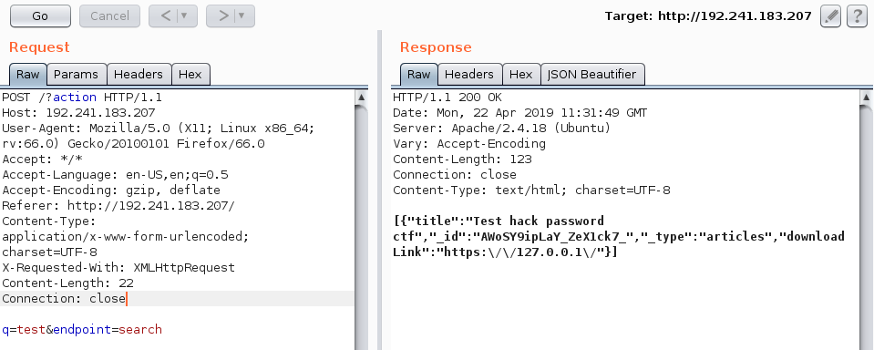
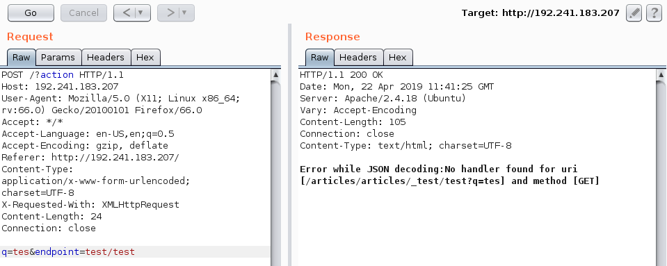
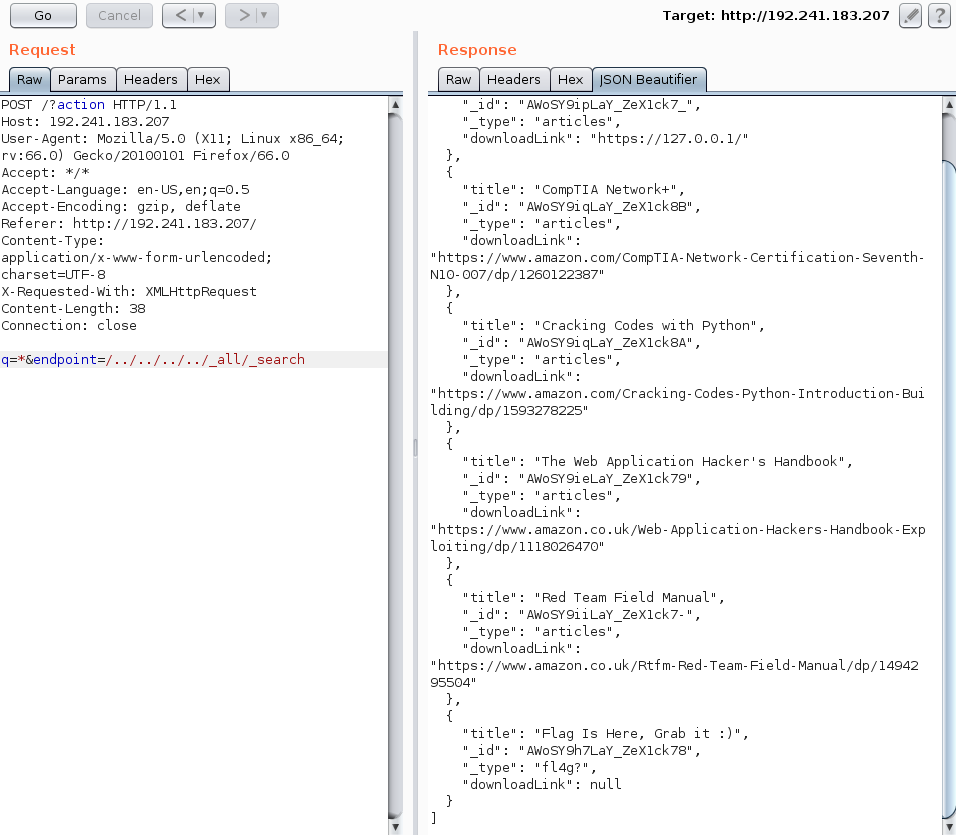
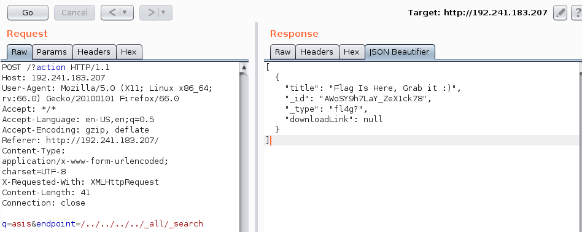
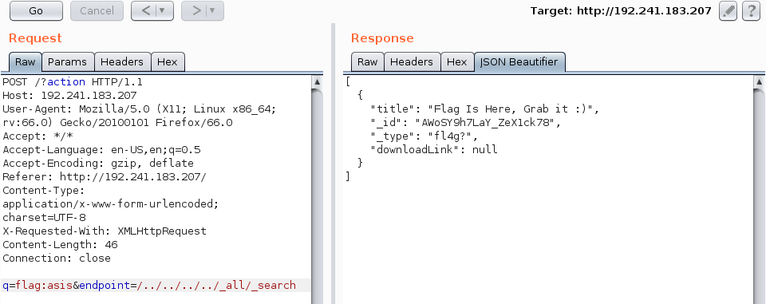
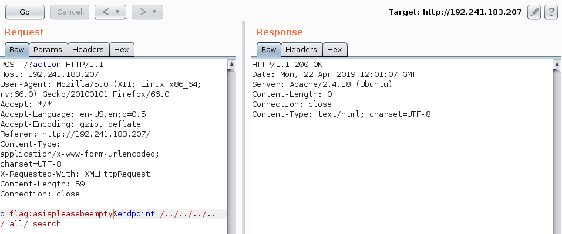
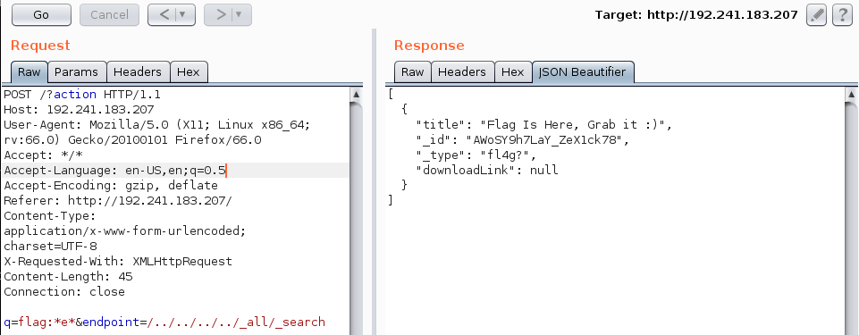

# Dead engine 
> Have you ever thought, what would you have done if you had access to all the [data stored](http://192.241.183.207/) on the Google database?  
> Please don't scan the server! It won't help you.

This challenge was solved alongside rkmylo.

Visiting the page, we can see a simple search engine. We search for "test" and get the following result:



We try to change "endpoint" parameter to "test123" and get "illegal_argument_exception".
We then try messing with "q" parameter and we notice that when the value is "test{", we get a "query_shard_exception" error.  
By googling the errors, we come to the conclusion that the server is querying an Elasticsearch backend!  
After messing a bit more with the endpoint parameter, we get the following message:



So we're currently searching "articles" index, but we can change that :)  
We [search across all indexes](https://www.elastic.co/guide/en/elasticsearch/reference/current/search-search.html) and find the following:



There is a result saying "Flag Is Here, Grab it :)" but there is no flag to grab :(  
After messing with the parameters, we tried ```q=asis``` ("asis" is the standard part of flags) and got the following result:



Apparently, we cannot view the flag, but we can search for it :)
We quickly found that it was stored in the "flag" tag, but we had serious difficulties searching for the "{" symbol! However, we still have a boolean primitive and that's all we need ;)





We tried searching from the middle of the flag content instead of the start:



So, given that the flag only contains alphanumeric and "_" characters, we make our first attempt to guess it (solver.py)
The solver guesses from "e" to the right, and when it finds nothing, it starts going to the left!
It prints the hash 2a6e210f10784c9a0197ba164b94f25d, and we submit ASIS{2a6e210f10784c9a0197ba164b94f25d}, which was the correct flag :)

References for Elastic search:  
https://gist.github.com/Mpdreamz/6572344  
https://www.elastic.co/guide/en/elasticsearch/reference/current/search-search.html  
https://www.elastic.co/guide/en/elasticsearch/reference/current/query-dsl-query-string-query.html  

