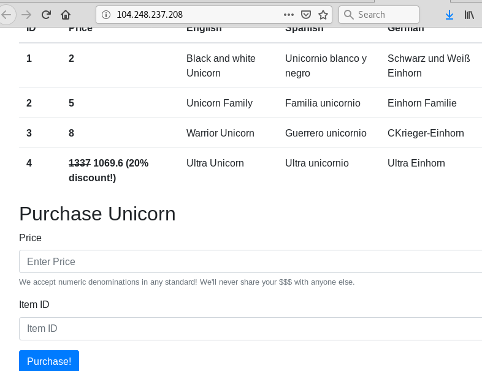
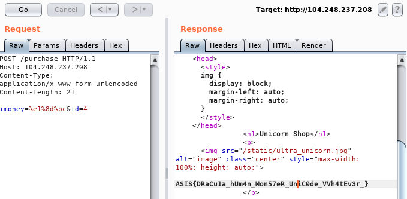

# Unicorn shop

>Some people say you can buy anything, even love! What about unicorns?  
>"A person does not buy a unicorn so easily, it’s really a matter of preparing yourself to be worthy of a unicorn."  
>[Unicorn Shop](http://104.248.237.208/)  

##### This challenge was solved along with deltaclock.

We arive at a site from where you can buy unicorns:


We probably have to purchase "Ultra Unicorn" to get the flag. However, "Price" can be only of length 1! So we can pay a maximum of 9 coins. "NaN", "INF", negative numbers and other tricks did not work. However, there's something odd in the source code:
```HTML
<meta charset="utf-8"> <!-- important! -->
```
That's probably a hint towards using unicode! [Here's a list of unicode numbers.](https://www.fileformat.info/info/unicode/category/Nd/list.htm)
Unicode numbers were accepted (e.g U+0CEF could buy you unicorns 1,2 and 3) but the "1 char only" problem still persists. I searched for how unicode characters are converted to integers and found [unicodedata](https://docs.python.org/2/library/unicodedata.html). 
```unicodedata.digit``` returns the corresponding digit, whereas ```unicodedata.numeric```  "Returns the numeric value assigned to the Unicode character unichr as float."

Hmmm why should those 2 be different?

Using a simple python script we find the answer:
```
root@tree:~# cat uni.py 
import unicodedata

for i in range(0,0xffff):
	try:
		pame=unicodedata.numeric(unichr(i))
		if pame>1200:
			print "{} : {}".format(i,pame)
	except:
		pass
root@tree:~# python uni.py 
4988 : 10000.0
8577 : 5000.0
8578 : 10000.0
8583 : 50000.0
8584 : 100000.0
19975 : 10000.0
20159 : 100000000.0
20740 : 100000000.0
20806 : 1e+12
33836 : 10000.0

```

It seems like some unicode characters correspond to pretty large integers :D

We try our luck with 20159 and get the flag:




